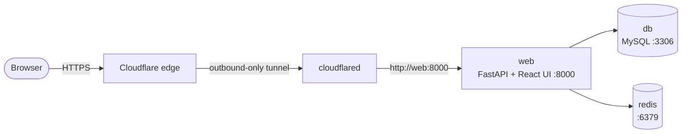

# Inward Outward System (TCET)

College inward/outward application tracker. One FastAPI process serves both the API (`/api/...`) and the built React UI on port `8000`. Public access is via Cloudflare Tunnel (no open firewall ports needed).

## Quick setup (production)

```bash
git clone <repo-url> && cd inward-outward-system
cp .env.example .env   # then fill in real values (see below)
docker compose up -d --build
```

Open the public URL from your tunnel (e.g. `https://tcetioms.in`) and log in with a seeded account (OTP goes to the `SEED_*` email).

## What to put in `.env`

Only these matter most (full list in `.env.example`):

| Variable | Value |
|---|---|
| `MYSQL_ROOT_PASSWORD` / `DB_ROOT_PASSWORD_URL` | Same password, raw + URL-encoded |
| `REDIS_PASSWORD`, `JWT_SECRET` | Strong random strings |
| `CLOUDFLARE_TUNNEL_TOKEN` | From Cloudflare Zero Trust → Networks → Tunnels |
| `CLIENT_URL` / `CORS_ORIGINS` | Exact public URL, e.g. `https://tcetioms.in` |
| `EMAIL_*` | SMTP account for OTP emails |
| `SEED_ADMIN_EMAIL` / `SEED_CLERK_EMAIL` | Real inboxes for first login |

Generate a secret: `python3 -c "import secrets; print(secrets.token_urlsafe(64))"`

## Useful commands

```bash
docker compose ps                    # status
docker compose logs -f web           # app logs
docker compose logs -f cloudflared   # tunnel ("Registered tunnel connection")
git pull && docker compose up -d --build   # deploy an update
curl http://127.0.0.1:8000/api/health      # local health check
```

Never run `docker compose down -v` (deletes the database).

## Architecture (docker-compose)



- `web` is the only app: serves API + built UI on `8000` (localhost-only).
- `cloudflared` exposes it publicly without opening any firewall port.
- `db` / `redis` are reachable only inside the compose network.

## Local development (optional)

Backend: `python -m venv .venv && source .venv/bin/activate && pip install -r requirements.txt && uvicorn server:app --reload`

Frontend: `cd client && npm install && npm run dev`

Details: see `DEPLOY.md`.
