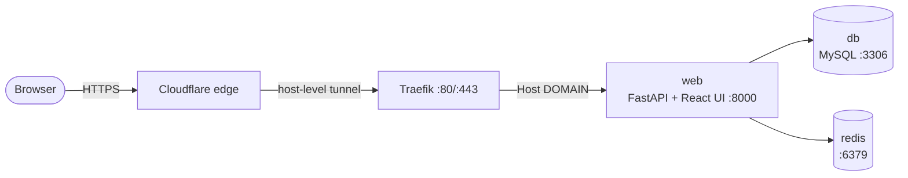

# Inward Outward System (TCET)

College inward/outward application tracker. One FastAPI process serves both the API (`/api/...`) and the built React UI on port `8000`. Public ingress is handled by the platform (Dokploy + Traefik); the compose stack itself publishes no ports.

## Quick setup (production, Dokploy)

```bash
git clone <repo-url> && cd inward-outward-system
cp .env.example .env   # then fill in real values (see below)
docker compose up -d --build
```

Prerequisites on the host: the external `dokploy-network` must exist (`docker network create dokploy-network` if needed) and `DOMAIN` must be set in `.env`.

Open `https://<DOMAIN>` (e.g. `https://tcetioms.in`) and log in with a seeded account (OTP goes to the `SEED_*` email).

## What to put in `.env`

Only these matter most (full list in `.env.example`):

| Variable | Value |
|---|---|
| `DOMAIN` | Domain Traefik routes, e.g. `tcetioms.in` |
| `MYSQL_ROOT_PASSWORD` / `DB_ROOT_PASSWORD_URL` | Same password, raw + URL-encoded |
| `REDIS_PASSWORD`, `JWT_SECRET` | Strong random strings |
| `CLIENT_URL` / `CORS_ORIGINS` | Exact public URL, e.g. `https://tcetioms.in` (must match `DOMAIN`) |
| `EMAIL_*` | SMTP account for OTP emails |
| `SEED_ADMIN_EMAIL` / `SEED_CLERK_EMAIL` | Real inboxes for first login |

Generate a secret: `python3 -c "import secrets; print(secrets.token_urlsafe(64))"`

No tunnel token lives in the repo or compose — the Cloudflare connector (if used) runs once at host level, outside this stack.

## Useful commands

```bash
docker compose ps                    # status
docker compose logs -f web           # app logs
git pull && docker compose up -d --build   # deploy an update
```

Never run `docker compose down -v` (deletes the database). No automatic backup is configured for the `mysql_data`, `redis_data`, `media_data` volumes — enable that on the host before real data lands.

## Architecture (docker-compose)



- `web` is the only app: serves API + built UI on `8000`, no published ports.
- Traefik routes `Host(`${DOMAIN}`)` to `web` over `dokploy-network`.
- `db` / `redis` are reachable only inside the compose network.

## Local development (optional)

Backend: `python -m venv .venv && source .venv/bin/activate && pip install -r requirements.txt && uvicorn server:app --reload`

Frontend: `cd client && npm install && npm run dev`

Details: see `DEPLOY.md`.
